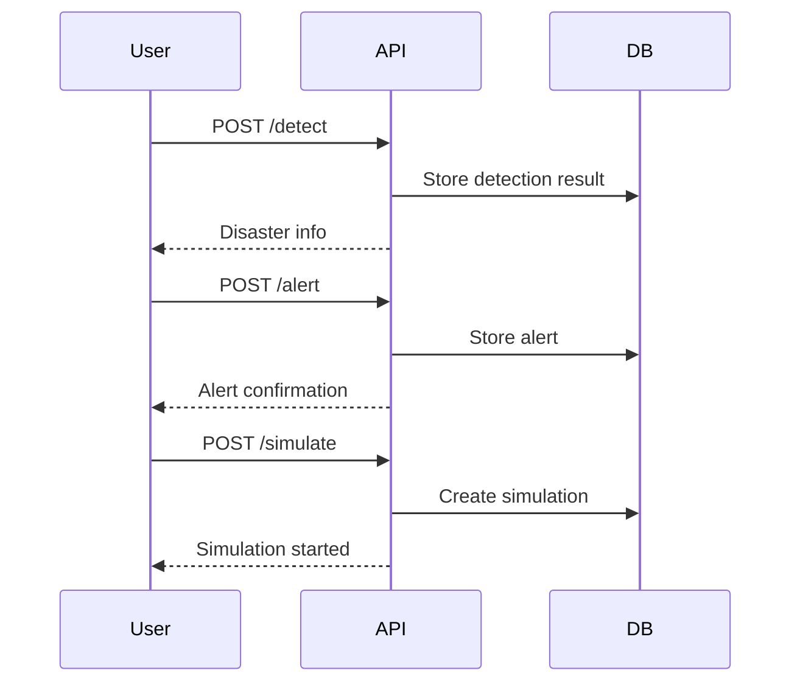

# CrowdSense API Documentation

## Overview
This document describes the REST API endpoints for the CrowdSense platform, which provides disaster detection, alerting, and simulation services.

---

## Base URL
```
http://<host>:<port>/
```

---

## Endpoints

### 1. Disaster Detection
- **POST** `/detect`
  - **Description:** Detects disasters from input data.
  - **Request Body:**
    ```json
    {
      "data": <input_data>
    }
    ```
  - **Response:**
    ```json
    {
      "disaster": <detected_disaster>,
      "confidence": <float>
    }
    ```

### 2. Alert Management
- **POST** `/alert`
  - **Description:** Sends an alert to users.
  - **Request Body:**
    ```json
    {
      "message": "string",
      "location": "string"
    }
    ```
  - **Response:**
    ```json
    {
      "status": "sent",
      "alert_id": <id>
    }
    ```

- **GET** `/alerts`
  - **Description:** Retrieves all alerts.
  - **Response:**
    ```json
    [
      {
        "alert_id": <id>,
        "message": "string",
        "location": "string",
        "timestamp": "datetime"
      }, ...
    ]
    ```

### 3. Simulation
- **POST** `/simulate`
  - **Description:** Triggers a disaster simulation.
  - **Request Body:**
    ```json
    {
      "type": "earthquake|flood|fire|...",
      "location": "string"
    }
    ```
  - **Response:**
    ```json
    {
      "simulation_id": <id>,
      "status": "started"
    }
    ```

- **GET** `/simulation/<id>`
  - **Description:** Gets the status of a simulation.
  - **Response:**
    ```json
    {
      "simulation_id": <id>,
      "status": "running|completed|failed"
    }
    ```

---

## Error Handling
All errors return JSON with an `error` field and a message.

---

## Authentication
- (Optional) API key or token-based authentication can be added for production use.

---

## Example Sequence Diagram



---

## Contact
For more information, see the [README.md](README.md) or contact the maintainers.
